# 👋 Hey, I'm Francis

<!-- ANIMATED-CARDS:START -->
<table>
  <tr>
    <td></td>
    <td></td>
  </tr>
</table>

  

<!-- ANIMATED-CARDS:END -->

I'm a software engineer interested in backend systems, full-stack development, and applied AI. My work includes campus mentorship software, accessibility applications, and collaborative AI projects.

I like understanding how the pieces of a product fit together: what happens after a request reaches the server, how the data is organized, and where things can break. Those questions shape how I approach a problem, choose an implementation, and think through the tradeoffs.

I've worked on mentor and mentee dashboards with Node.js, Express, and MongoDB, explored accessible communication with Flutter, and worked with Team Anote through Break Through Tech AI on autonomous agents. I enjoy turning a real need into software and working through the details that make it useful.

---

### 🛠️ Technologies & Tools

  

**Also worked with:** HTML, CSS, Mongoose, VS Code, and Jupyter notebooks.

---

### 🔧 What I'm Focused On

- Strengthening my data structures, algorithms, and problem-solving fundamentals.
- Deepening my understanding of backend services, API design, and data modeling.
- Learning how testing, authentication, and error handling make applications more reliable.
- Exploring how AI agents coordinate tasks, use tools, and handle failures.
- Thinking through performance, accessibility, and the tradeoffs behind product decisions.

---

### 🧩 A Few Things I've Worked On

- **[Autonomous Intelligence](https://github.com/FrancisGyamfi/Autonomous-Intelligence):** Worked with Team Anote through Break Through Tech AI on autonomous agents. This repository contains Anote's framework for coordinating specialized agents, tools, and workflows.

- **[Infinity Ability Connect](https://github.com/FrancisGyamfi/infinity_ability_connect-IAC-):** A Flutter accessibility prototype exploring speech input, letter-by-letter sign imagery, and sign-language learning screens.

- **Black Male Initiative Web App:** Worked on mentor and mentee dashboards and forms for a campus mentorship application using Node.js, Express, MongoDB, and Mongoose.

- **[Airbnb Machine Learning Lab](https://github.com/FrancisGyamfi/ml-lab5-airbnb-analysis):** Python coursework exploring logistic regression and model selection with Airbnb data.

---

### 🎒 A Little About Me

I study Computer Science and Computer Information Systems at **Grambling State University**. I care about both how software works and how people experience it. I value clear communication, thoughtful feedback, and following a problem through to a solution.

Outside of coding, I direct live broadcasts and make films. Live production has taught me to communicate clearly, troubleshoot under pressure, and understand how my decisions affect the rest of a team. For **[ClassSync](https://github.com/FrancisGyamfi/Classync)**, a team-built classroom attendance app, I served as **Video Production Lead**.

I also help connect students with opportunities as **ColorStack GSU's founding Communications & Outreach Chairperson** and **General Secretary of the Black Male Initiative**.

---

### 📬 Let's Connect

  
  

**Let's connect around software engineering, applied AI, and useful products.**

> *Understand the problem. Build with care. Keep improving.*

