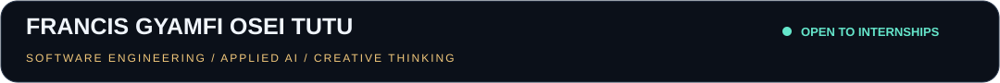
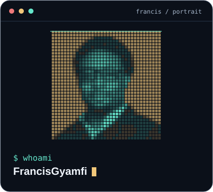
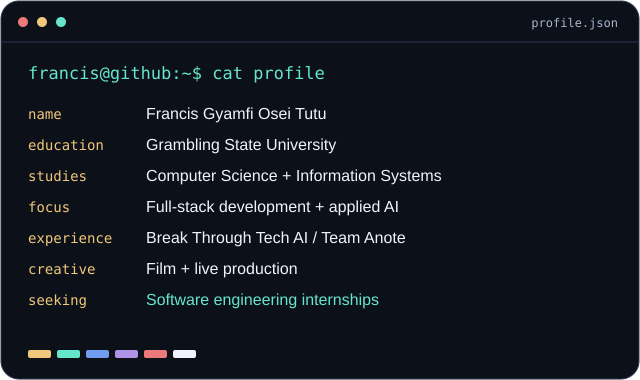
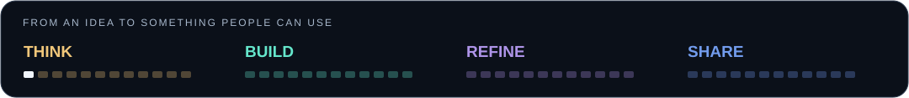
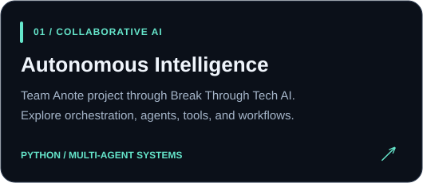
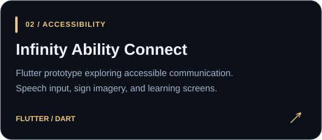
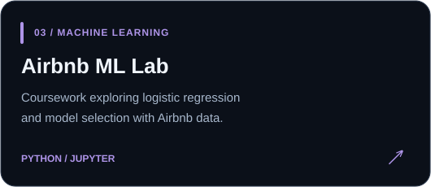
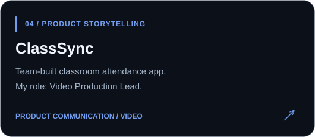
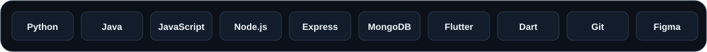

  

<table>
  <tr>
    <td width="39%"></td>
    <td width="61%"></td>
  </tr>
</table>

  
   
  <b>Open to software engineering internships • Full-stack development • Applied AI</b>

## Hey, I'm Francis 👋

I'm studying **Computer Science and Computer Information Systems at Grambling State University**. I like taking a problem people deal with and figuring out what I can build to make it easier.

That interest has taken me from web development to accessibility projects and collaborative AI systems through **Break Through Tech AI and Team Anote**. I'm especially interested in how an interface, its backend, and its data fit together to make a useful product.

Outside of coding, I make films and direct live broadcasts. Both have taught me to think about the person on the other side of the screen, explain ideas clearly, and stay composed when something needs fixing.

  

## Selected projects

<table>
  <tr>
    <td width="50%"></td>
    <td width="50%"></td>
  </tr>
  <tr>
    <td width="50%"></td>
    <td width="50%"></td>
  </tr>
</table>

## My toolkit

**Web:** HTML, CSS, JavaScript, Node.js, Express.js  
**Data:** MongoDB, Mongoose  
**Programming & mobile:** Python, Java, Flutter, Dart  
**Development & design:** Git, GitHub, VS Code, Figma

## What I'm focused on

- Building a stronger foundation in backend development, APIs, and data structures.
- Exploring how AI agents coordinate tasks and use tools.
- Making applications easier to understand and more accessible.
- Connecting technical work with thoughtful product design.

## Beyond the keyboard

I help build community as **ColorStack GSU's founding Communications & Outreach Chairperson** and **General Secretary of the Black Male Initiative**. I also work in live production with **GSU Athletics** and create films and visual stories.

Those experiences keep me close to the things I enjoy most: making something useful, working with people, and turning an idea into something others can experience.

---

  <b>Have an internship opportunity or a project in mind?</b> 
  <a href="https://www.linkedin.com/in/francisot/">Let's connect on LinkedIn.</a>

