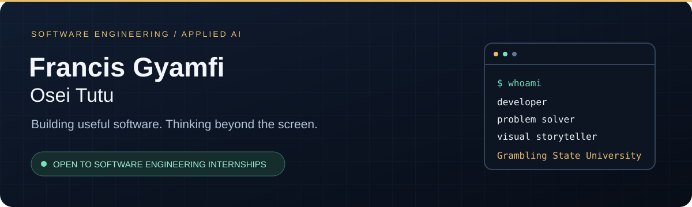

  

  

## Hey, I'm Francis 👋

I'm a Computer Science and Computer Information Systems student at **Grambling State University**, interested in building software that makes everyday tasks easier. My work spans web development, accessibility, and collaborative AI systems.

I also direct live broadcasts and create films. That experience shapes how I build: understand the audience, communicate clearly, and pay attention to what happens when people actually use the product.

**I'm actively seeking software engineering internships**, with interests in full-stack development, applied AI, and developer tools.

## Selected work

### [Autonomous Intelligence](https://github.com/FrancisGyamfi/Autonomous-Intelligence)
**Collaborative AI systems · Break Through Tech AI / Anote**

Through Break Through Tech AI, I worked with Team Anote on autonomous agents. This repository contains Anote's open-source framework for coordinating agents, tools, and workflows through an orchestrator.

[Explore the framework →](https://github.com/FrancisGyamfi/Autonomous-Intelligence)

### [Infinity Ability Connect](https://github.com/FrancisGyamfi/infinity_ability_connect-IAC-)
**Accessibility prototype · Flutter / Dart**

A mobile app project exploring more accessible communication. The code includes speech input and letter-by-letter sign imagery, alongside sign-language learning screens. It's a prototype, with room to improve the experience and expand its capabilities.

[Explore the code →](https://github.com/FrancisGyamfi/infinity_ability_connect-IAC-/tree/main/lib)

### [Airbnb Machine Learning Lab](https://github.com/FrancisGyamfi/ml-lab5-airbnb-analysis)
**Machine learning coursework · Python / Jupyter**

A notebook-based project on model selection for logistic regression using Airbnb data, part of my work developing a stronger foundation in machine learning.

[Read the notebook →](https://github.com/FrancisGyamfi/ml-lab5-airbnb-analysis/blob/main/ModelSelectionForLogisticRegression.ipynb)

<b>Where software meets storytelling: ClassSync</b>

 

[ClassSync](https://github.com/FrancisGyamfi/Classync) is a team-built iOS classroom attendance application. I served as **Video Production Lead**, creating commercial video content to communicate the product's purpose and experience.

## Tools I work with

| Area | Technologies |
| :--- | :--- |
| Programming | Python, Java, JavaScript |
| Web development | HTML, CSS, Node.js, Express.js |
| Data | MongoDB, Mongoose |
| Mobile projects | Flutter, Dart |
| Development & design | Git, GitHub, VS Code, Figma |

## Beyond the code

- **Break Through Tech AI:** Collaborative AI project experience with Team Anote.
- **ColorStack GSU:** Founding Communications & Outreach Chairperson.
- **Black Male Initiative:** General Secretary, supporting mentorship and community.
- **GSU Athletics:** Live production experience across multi-camera sporting events.
- **Creative work:** Filmmaking, editing, and visual storytelling.

---

  Interested in my work? <a href="https://www.linkedin.com/in/francisot/"><b>Let's connect.</b></a> 
  Software with purpose. Stories with perspective.

